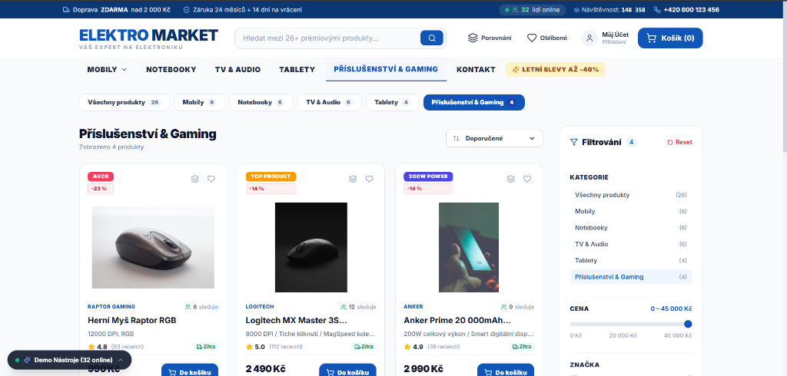
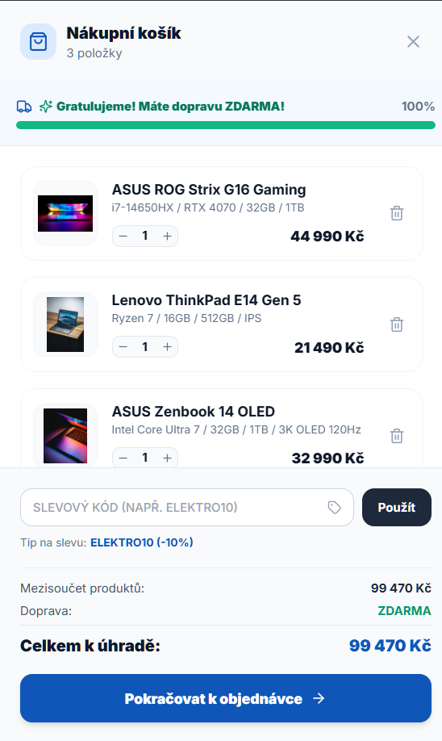
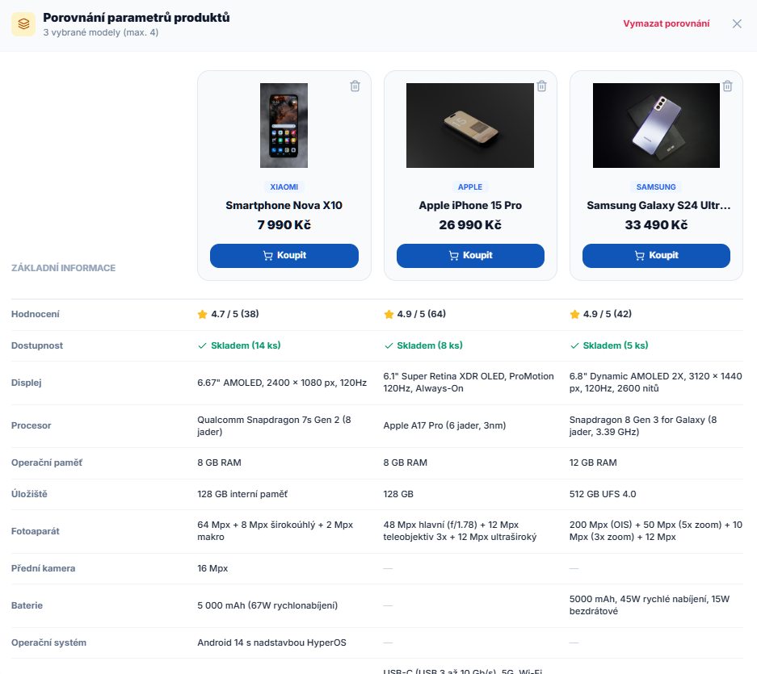

# 🛒 ELEKTRO MARKET – Moderní E-shop Šablona

> **English version**: [README.en.md](./README.en.md)

> **🌐 Živá verze webu:** [https://react-ecommerce-eshop-template-bn4fcw629-s-beba.vercel.app/](https://react-ecommerce-eshop-template-bn4fcw629-s-beba.vercel.app/)

Plně funkční, responzivní prezentační šablona moderního e-shopu se spotřební elektronikou, navržená pro okamžité nasazení a prezentaci potenciálním klientům.

---

## 📖 O Projektu

Tato šablona vznikla jako ukázka moderního frontendového přístupu k e-commerce řešení bez závislosti na těžkých frameworkech jako Next.js nebo Remix. Cílem bylo vytvořit **lehkou, rychlou a plně funkční** šablonu, kterou lze napojit na libovolný backend.

### Proč tato technologická volba?

- **React 18** — ověřený ekosystém, široká komunita, snadná údržba
- **TypeScript (strict mode)** — přísné typování (strict: true, 
oUnusedLocals, 
oUnusedParameters) zajišťuje menší množství bugů v produkci
- **Vite** — bleskově rychlý dev server a build, HMR bez zdržení
- **Tailwind CSS** + clsx + 	ailwind-merge — utility-first přístup s čistým API pro podmíněné třídy

### Architektura a netriviální problémy

- **Správa stavu přes React Context API** — zvolena pro jednoduchost a nulové závislosti. Projekt používá 4 nezávislé kontexty (CartContext, ComparisonContext, VisitorContext, WishlistContext), každý řeší svou doménu a nedochází k zbytečnému re-renderingu.
- **Multi-step checkout (4 kroky)** — stavový automat v CheckoutModal.tsx řídí průchod: kontrola košíku → doprava a platba → adresa → potvrzení s generováním čísla objednávky EM-XXXXXX a konfetovým efektem.
- **Cart drawer s progress barem** — CartDrawer.tsx řeší slide-over logiku, live přepočet mezisoučtu, systém kupónů (ELEKTRO10, VIP20, LETO2026, SLEVA500) a animovaný progress bar pro dopravu zdarma (od 2 000 Kč).
- **Live vyhledávání s debouncingem** — fulltextový našeptávač v Header.tsx s náhledem obrázků, cen a stavu skladu v reálném čase.
- **Simulace social proof** — VisitorContext + LiveSalesNotification generují náhodná demo data (online zákazníci, notifikace nákupů, počítadlo návštěv).

> ⚠️ **Důležité:** Všechna data o návštěvnících, objednávkách a plovoucích notifikacích (např. *„Petr K. (Praha) právě zakoupil..."*) jsou **simulovaná/demo data** generovaná na klientovi. Nejedná se o reálná data z produkce. Slouží výhradně pro prezentaci funkčnosti šablony.

---

## 📸 Ukázky z E-shopu

### 1. Hlavní stránka & Hero Banner s živým počítadlem

### 2. Katalog produktů, rychlé pilulky & pokročilé filtrování

### 3. Interaktivní nákupní košík s dopravou zdarma a slevami

### 4. Detailní srovnávač parametrů produktů

> 💡 **Tip:** Pro lepší přehled flow doporučuji přidat krátký GIF ukazující: přidání produktu do košíku → otevření košíku → průchod checkoutem.

---

## 🌟 Klíčové Funkce

- 🎯 **Moderní a čistý design** — Hlavička s logem, navigační menu s dropdowny kategorií, dynamický Hero Banner a katalog produktů.
- ⚡ **Živé Fulltextové Vyhledávání** — Okamžitý našeptávač produktů v reálném čase s náhledem obrázků, cen a stavu skladu.
- 👥 **Živý Systém Návštěvnosti (demo data)** — Pulzující indikátor online zákazníků, počítadlo zhlédnutí, plovoucí notifikace nákupů. *Vše simulovaná data.*
- 🛒 **Interaktivní Nákupní Košík** — Slide-over drawer, progress bar pro dopravu zdarma, systém slevových kupónů.
- 💳 **Kompletní Pokladna (4 kroky)** — Kontrola košíku → Doprava/Platba → Adresa (včetně nákupu na firmu s IČO/DIČ) → Potvrzení s konfetami.
- 🔍 **Detail Produktu (Quick View)** — Galerie fotografií, technické specifikace, recenze s hvězdičkami.
- ⚖️ **Porovnávač Parametrů & Oblíbené** — Srovnání až 4 produktů v přehledné tabulce.
- 🎛️ **Klientský Demo Panel** — Plovoucí lišta pro rychlou ukázku (naplnění košíku, přepínání měn CZK/EUR, testovací kupóny).

---

## 🧪 Testovací Slevové Kódy

| Kód | Sleva |
|---|---|
| ELEKTRO10 | 10 % |
| VIP20 | 20 % |
| LETO2026 | 15 % |
| SLEVA500 | 500 Kč |

---

## 📁 Struktura Projektu

`
├── public/                    # Statické soubory
├── src/
│   ├── components/            # UI komponenty (15 souborů)
│   │   ├── CartDrawer.tsx           # Slide-over nákupní košík
│   │   ├── CheckoutModal.tsx        # Multi-step pokladna
│   │   ├── ComparisonModal.tsx      # Srovnávač parametrů
│   │   ├── ContactModal.tsx         # Kontaktní formulář
│   │   ├── DemoBar.tsx              # Klientský demo panel
│   │   ├── Footer.tsx               # Patička stránky
│   │   ├── Header.tsx               # Hlavička s navigací a vyhledáváním
│   │   ├── HeroBanner.tsx           # Hlavní banner
│   │   ├── LiveSalesNotification.tsx # Plovoucí notifikace nákupů
│   │   ├── ProductCard.tsx          # Karta produktu
│   │   ├── ProductDetailModal.tsx   # Detail produktu (quick view)
│   │   ├── ProductGrid.tsx          # Mřížka produktů
│   │   ├── SidebarFilters.tsx       # Postranní filtry
│   │   ├── Toast.tsx                # Notifikační bubliny
│   │   └── WishlistModal.tsx        # Seznam oblíbených
│   ├── context/               # React Context providery
│   │   ├── CartContext.tsx           # Stav nákupního košíku
│   │   ├── ComparisonContext.tsx     # Stav porovnávače
│   │   ├── VisitorContext.tsx        # Simulace návštěvnosti
│   │   └── WishlistContext.tsx       # Stav oblíbených
│   ├── data/                  # Statická data
│   │   └── products.ts              # Mock databáze produktů
│   ├── types/                 # TypeScript typy
│   │   └── index.ts                 # Definice typů (Product, CartItem, atd.)
│   ├── App.tsx                # Hlavní komponenta aplikace
│   ├── index.css              # Globální styly (Tailwind)
│   └── main.tsx               # Vstupní bod aplikace
├── .github/workflows/         # GitHub Actions (CI/CD)
├── docs/screenshots/          # Screenshoty pro README
├── index.html                 # HTML šablona
├── package.json               # Závislosti a skripty
├── tsconfig.json              # Konfigurace TypeScript (strict mode)
├── vite.config.ts             # Konfigurace Vite
├── tailwind.config.js         # Konfigurace Tailwind CSS
└── postcss.config.js          # PostCSS konfigurace
`

---

## 🛠️ Tech Highlights

| Technologie | Verze | Účel |
|---|---|---|
| React | 18.3.1 | UI framework |
| TypeScript | 5.6.3 | Typová bezpečnost (strict mode) |
| Vite | 6.0.0 | Build nástroj a dev server |
| Tailwind CSS | 3.4.17 | Utility-first styling |
| Lucide React | 0.475.0 | Ikony |
| Canvas Confetti | 1.9.4 | Efekt konfet při potvrzení objednávky |
| clsx + tailwind-merge | 2.1.1 / 2.5.5 | Podmíněné třídy a merge Tailwind tříd |

**Klíčové technické rozhodnutí:** Žádná externí state management knihovna (Redux, Zustand). Celý stav řeší React Context API — lehké, bez závislostí, dostatečné pro template šablonu.

---

## 🚀 Lokální Spuštění

`ash
# 1. Klonování repozitáře
git clone https://github.com/hck6ladik-coder/react-ecommerce-eshop-template.git
cd react-ecommerce-eshop-template

# 2. Instalace závislostí
npm install

# 3. Spuštění vývojového serveru
npm run dev
`

### Produkční sestavení:
`ash
npm run build
`

### Náhled produkční verze:
`ash
npm run preview
`

---

## 📄 Licence

Tento projekt je licencován pod [MIT Licencí](./LICENSE).

---

## 🤝 Autor

**hck6ladik-coder** — [GitHub](https://github.com/hck6ladik-coder)
