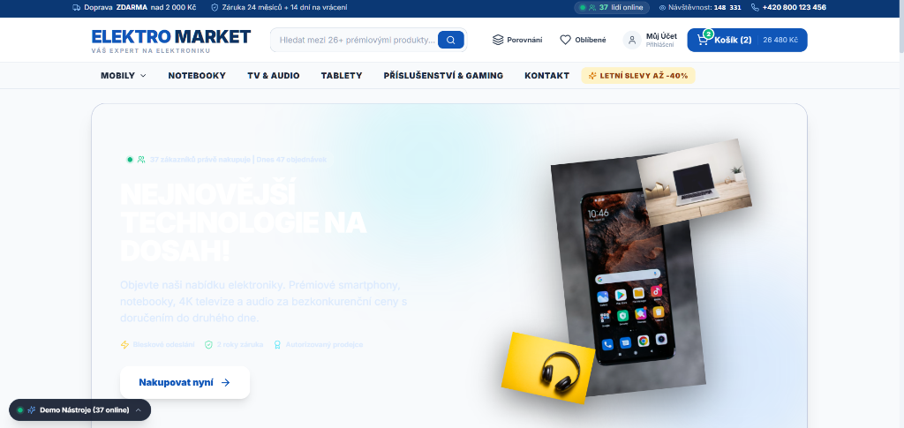
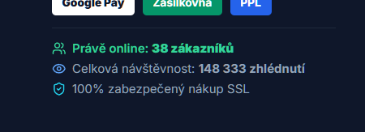

# 🛒 ELEKTRO MARKET – Moderní E-shop Šablona pro Klienty

[](https://hck6ladik-coder.github.io/tvuj-web/)
[](https://reactjs.org/)
[](https://www.typescriptlang.org/)
[](https://vitejs.dev/)
[](https://tailwindcss.com/)

> **🌐 Živá verze webu:** [https://hck6ladik-coder.github.io/tvuj-web/](https://hck6ladik-coder.github.io/tvuj-web/)

Plně funkční, responzivní prezentační šablona moderního e-shopu se spotřební elektronikou, navržená pro okamžité nasazení a prezentaci potenciálním klientům.

---

## 📸 Ukázky z E-shopu (Screenshots)

### 1. Hlavní stránka & Hero Banner s živým vyhledáváním


### 2. Živé statistiky návštěvnosti & Sociální důkaz


---

## 🌟 Klíčové Funkce

- 🎯 **Moderní a čistý design**: Hlavička s logem, navigační menu s dropdowny kategorií, dynamický Hero Banner a katalog produktů.
- ⚡ **Živé Fulltextové Vyhledávání**: Okamžitý našeptávač produktů v reálném čase s náhledem obrázků, cen a stavu skladu.
- 👥 **Živý Systém Návštěvnosti (Social Proof)**:
  - 🟢 Pulzující zelený indikátor online zákazníků v horní liště, banneru, kartách produktů i patičce.
  - Celkové počítadlo zhlédnutí a denní počet objednávek.
  - Plovoucí notifikace reálných nákupů zákazníků (např. *„Petr K. (Praha) právě zakoupil...“*).
- 🛒 **Interaktivní Nákupní Košík (Slide-over Cart Drawer)**:
  - Okamžitý přepočet mezisoučtu a úprava počtu kusů (+ / -).
  - Progress bar pro dopravu zdarma (od 2 000 Kč).
  - Uplatnění slevových kupónů (`ELEKTRO10`, `VIP20`, `LETO2026`).
- 💳 **Kompletní Pokladna (Multi-Step Checkout)**:
  - Krok 1: Kontrola položek v košíku.
  - Krok 2: Volba dopravy (Zásilkovna, PPL kurýr, Balíkovna, Osobní odběr) a platby (Karta 3D Secure, Apple/Google Pay, QR platba, Dobírka).
  - Krok 3: Dodací a fakturační adresa (včetně nákupu na firmu s IČO/DIČ).
  - Krok 4: Potvrzení objednávky s generováním čísla `EM-XXXXXX`, konfetovým efektem a tiskem potvrzení.
- 🔍 **Detail Produktu (Quick View Modal)**: Galerie fotografií, technické specifikace, recenze s hvězdičkami.
- ⚖️ **Porovnávač Parametrů & Oblíbené (Wishlist)**: Srovnání až 4 vybraných produktů v přehledné tabulce parametrů.
- 🎛️ **Klientský Demo Panel**: Plovoucí lišta vlevo dole pro rychlou ukázku (naplnění košíku 1 kliknutím, přepínání měn CZK / EUR, testovací kupóny).

---

## 🧪 Testovací Slevové Kódy

Při prezentaci košíku můžete uplatnit tyto připravené slevové kupóny:
- `ELEKTRO10` – Sleva 10 %
- `VIP20` – Sleva 20 %
- `LETO2026` – Sleva 15 %
- `SLEVA500` – Sleva 500 Kč

---

## 🚀 Lokální Spuštění

```bash
# 1. Instalace závislostí
npm install

# 2. Spuštění vývojového serveru
npm run dev
```

### Produkční sestavení:
```bash
npm run build
```

---

## 🛠️ Použité Technologie

- **Frontend**: React 18, TypeScript
- **Styling**: Tailwind CSS
- **Build Tool**: Vite
- **Ikony**: Lucide React
- **Efekty**: Canvas Confetti
